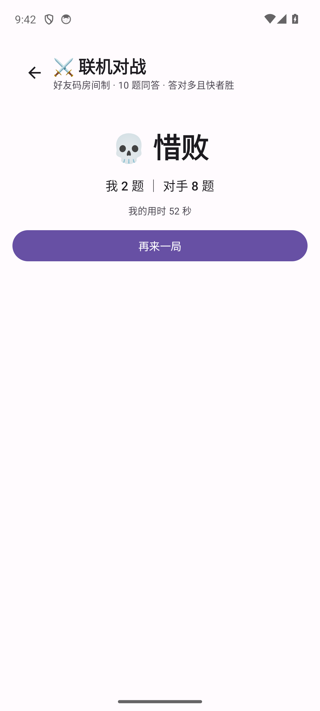
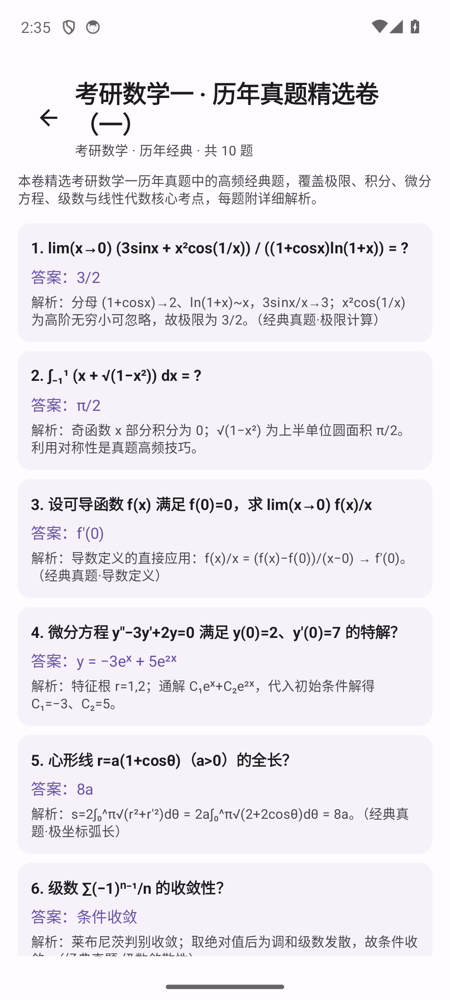

# 🧠 脑力大冒险 — 益智学习手游合集

> © 2026 ING-49 · 本项目未采用开源许可证，保留所有权利（All Rights Reserved）。
> 📌 项目速览 / 待办 / 常用命令见 [`docs/HANDOFF.md`](docs/HANDOFF.md)。

单机益智学习手游（原生 Android / Kotlin + Jetpack Compose），五个小游戏共用一套成长线，
内置 **9 大科目题库**，并实现完整的三级更新体系：**内容热更新 / APK 增量更新 / APK 全量更新**。

> 全部代码由 ZCode 生成，已在 Android 13 (API 34) 模拟器上完成全流程实机验证。

## 一、游戏内容

### 界面速览
| 大厅 | 每日挑战 | 联机对战 |
|---|---|---|
|  |  |  |
| **战斗结算** | **真题试卷** | **联机结算** |
|  |  |  |

### 小游戏
| 游戏 | 玩法 | 学习点 |
|---|---|---|
| ⚔️ 速算英雄 | 回合答题 RPG：答对出招打怪物（连击加伤害）、答错挨打；8 关/科目，第 8 关 BOSS 战；道具（提示/跳过/复活） | 全科目题库 + 数学生成器 |
| 🧱 华容道 | 滑动棋子把曹操移到底部出口；6 个经典布局（将拥曹营/齐头并进/指挥若定/层层设防/横刀立马/兵分三路），记录最少步数 | 空间推理、路径规划 |
| ⚫ 五子棋 | 人机对战（本地 AI，简单/普通/困难三档，困难带两步预判），支持悔棋；记录总胜场与最佳连胜 | 攻防判断、棋型计算 |
| 🐍 贪吃蛇 | 2D 贪吃蛇：滑动转向，吃豆变长、速度随分数缓慢递增，撞墙/咬到自己结束 | 反应力、路线预判 |

### 成长线（连续性）
- 等级/经验、金币、商店（道具 / 5 款主题 / 12 款头像）
- 每日挑战（10 道混合题）+ 连续签到 + 连续挑战天数
- 🎓 **大学考研模式**（设置中开启）：开 → 每日挑战只出大学科目高难题（高数/线代/概率/高频/通信，难度4+，考研向）；关 → 基础入门题（数学口算/逻辑/英语/科学/编程，难度2）
- **错题本**：答错自动收录 + 复习模式（复习答对自动标记已掌握）
- 成就系统（12 个成就，自动检测解锁并发奖励）

### 题库（全部带答案解析）
数学口算与逻辑（**程序化生成，题量无限**）、英语单词 60、科学百科 55、编程基础 55、
高等数学 60+、线性代数 50、概率论 50、高频电子线路 45、通信原理 45。
科目与题目数量可在「设置与更新 → 更新中心」实时查看。

## 二、构建与运行

环境：JDK 17+、Android SDK（compileSdk 34）、任一 Android 8.0+ 设备/模拟器。

```bash
# 设置环境变量（按本机路径调整）
set JAVA_HOME=E:\Tools\jdk-17.0.20.1+1
set ANDROID_HOME=E:\Tools\Android-Studio\Android\SDK

# 构建
gradlew assembleDebug        # 产物: app/build/outputs/apk/debug/app-debug.apk

# 安装运行
adb install -r app/build/outputs/apk/debug/app-debug.apk
adb shell am start -n com.brainquest.game/.MainActivity
```

依赖仓库使用阿里云镜像（见 `settings.gradle.kts`），国内网络可直接构建。

## 三、更新体系（本项目核心亮点）

### 1. 内容热更新（无需重装）
题库/配对数据以 JSON 包形式从服务器下载，SHA-256 校验后直接生效，玩家无感知：
```
服务器 manifest.json → App 比对本地版本 → 下载 zip → 校验 → 解压到
filesDir/content/packs/<id>/ → 题库 Repository 重载 → 界面题数即时变化
```

### 2. APK 增量更新（自研 BQDELTA1 格式）
原理类似 bsdiff：PC 端对旧/新 APK 做滚动哈希块匹配，生成 **COPY/LIT 操作流**补丁（本演示 217KB ≈ 全量 1.3%）；
App 内下载补丁 → 用已安装 APK 合成新 APK → SHA-256 + 签名双重校验 → 调起系统安装器。

```
update-server/release.py          # 一键：打内容包 + 生成差分 + 生成 manifest + 自校验
update-server/delta.py            # BQDELTA1 差分编码器（numpy 加速）
app/.../update/BSPatch.kt         # App 端解码器（纯 Kotlin，无第三方依赖）
```

> 发布时服务端会用相同算法**自校验**合成结果 == 新版 APK 哈希，杜绝坏补丁上线。

### 3. APK 全量更新（兜底）
没有匹配的增量补丁时自动走全量下载安装。

### 演示/发布流程
```bash
# ① 电脑启动服务器（模拟器经 10.0.2.2:8000 访问）
启动更新服务器.bat        # 即 python -m http.server 8000

# ② 出新版：改代码后版本号 +1（app/build.gradle.kts 的 versionCode/versionName）
gradlew assembleDebug
copy app\build\outputs\apk\debug\app-debug.apk update-server\apks\BrainQuest-v<新版本>.apk

# ③ 发内容包：修改 update-server/packs/src/*.json（version 字段 +1），然后：
cd update-server && python release.py

# ④ App 内：设置与更新 → 检查更新 → 更新全部内容包 / 增量更新
```
- 内容包 JSON 格式与内置题库完全一致（`SubjectBankFile`），加题只需改 JSON
- 服务器是纯静态文件（manifest.json + apks/ + patches/ + packs/），生产环境可直接托管到
  GitHub Pages / Gitee Pages / OSS，App 内改一下服务器地址即可

### 合规说明
Android 高版本限制 DexClassLoader 代码级热更，本项目采用业内合规做法：
**内容（题库/词对/知识集）JSON 驱动可热更；逻辑变化走 APK 增量更新**（补丁仅几百 KB，体验接近热更）。

## 四、真机与公网部署（更新服务器）

更新系统只需要**静态文件**（manifest.json + apks/ + patches/ + packs/），没有后端逻辑。
只有玩家点「检查更新 / 下载」的那几秒需要网络能访问到这些文件，其余时间不需要服务运行。

### 场景 1：模拟器
电脑双击 `启动更新服务器.bat`（会自动显示服务地址），模拟器内 App 默认地址 `http://10.0.2.2:8000` 直接可用。

### 场景 2：真机（同一 Wi-Fi 局域网）
1. 电脑双击 `启动更新服务器.bat`，脚本会自动打印本机局域网地址（如 `http://192.168.1.5:8000`）
2. 手机连同一 Wi-Fi，App「设置 → 更新服务器地址」填入该地址 → 保存
3. 首次启动若 Windows 弹防火墙提示，点「允许访问」；若被拦截，管理员 PowerShell 执行：
   `netsh advfirewall firewall add rule name="BrainQuest Update" dir=in action=allow protocol=TCP localport=8000`

### 场景 2½：联机对战（三种方式，好友码 PK）
| 方式 | 需要什么 | 适用 |
|---|---|---|
| **热点对战**（推荐） | 无任何额外设备 | 房主开手机热点 + 创建房间，朋友连热点后「搜索附近房间」点击加入——**全程离线可玩** |
| **同 Wi-Fi 对战** | 同一 Wi-Fi | 房主创建房间后，朋友「搜索附近房间」自动发现（若搜不到是路由器 AP 隔离，改热点或手动输房主 IP） |
| **远程服务器对战** | 部署到公网的服务器 | 随时随地玩；客户端支持任意 ws:// 地址 |

- 对战规则：10 题同答（房主本地题库出题下发，含去重），答对多且快者胜；战绩在「我的」页

### 更新说明（旧版本 & 国内网络）
- **多版本补丁链**：v1.4.1 起发布产物包含 v1.1.2+ 所有历史版本 → 最新版的差分补丁（App 内自动匹配自己的版本），老版本也能走几 MB 内的补丁更新
- **国内多源回退**：检查更新与所有下载（补丁/APK/内容包）自动依次尝试 GitHub直连 → gh-proxy 镜像 → ghfast 镜像，逐源回退直至成功；界面显示当前使用的源；用户自定义地址时只走自定义
- **debug 签名版本**（v1.0.0~v1.1.0 分发过的）：因签名不同无法原地更新，需卸载重装一次，之后进入正常更新链
- 最稳方案（可选）：把 release 产物同步到阿里云 OSS/腾讯云 COS，App 更新服务器地址填 OSS 链接
- 服务端两种形态：`pk_server.py`（电脑/公网服务器）或 **App 内嵌服务器**（房主手机即服务器，v1.4.0 起）
- 已上线：快速匹配（同版本随机对手）+ ELO 排行榜（仅快速匹配计分，按科目分榜）+ 云存档

### 场景 3：GitHub Releases 托管（当前默认，推荐）
无需任何自己运行的服务。发版流程：
1. 改代码后把 `app/build.gradle.kts` 的 versionCode/versionName 升级
2. `gradlew assembleDebug` 构建，产物复制为 `update-server/apks/BrainQuest-v<版本>.apk`
3. `cd update-server && python release.py` 生成差分补丁与 manifest（内含自校验）
4. `GH_EXE=<gh路径> python tools/publish_github.py` → 自动创建 GitHub Release 并上传资产
5. App 服务器地址填 `https://github.com/ING-49/brainquest/releases/latest/download`
   （latest 永远指向最新 Release，App「检查更新」即从 GitHub 拉取）

### 场景 4：全自动发版（GitHub Actions）
已内置 `.github/workflows/release.yml`：把新版本打 tag（如 `v1.2.0`，须与 build.gradle.kts 的 versionName 一致）并 push，云端自动构建、生成差分、发布 Release。发版 = `git tag v1.2.0 && git push --tags`。

模拟器连不上 GitHub 时，可用开发中继：`python tools/dev_relay.py`（App 填 http://10.0.2.2:8000，主机代取 GitHub 内容）。
真机用户网络无法直连 GitHub 的，可自建中继或换国内静态托管（OSS 等），App 地址可配。
- 安全：补丁下载后 SHA-256 校验 + 合成后与安装前双重签名比对，被篡改的补丁装不上

## 五、工程结构
```
app/src/main/java/com/brainquest/game/
├── MainActivity.kt / AppViewModel.kt     # 入口与全局状态（存档/结算/成就）
├── data/                                  # 玩家存档(DataStore)、成就、道具
│   └── question/                          # 题库 schema/仓库/数学程序化生成器
├── game/
│   ├── quizbattle/                        # 游戏1 速算英雄（状态机+战斗界面）
│   ├── klotski/                           # 游戏2 华容道（含关卡与 BFS 校验过的参考步数）
│   ├── gomoku/                            # 游戏3 五子棋（本地启发式 AI）
│   └── snake/                             # 游戏4 贪吃蛇（2D）
├── update/                                # 更新引擎：manifest/下载校验/BSPatch/安装器
├── ui/                                    # 导航、大厅、关卡、商店、成就、错题本、设置
└── util/Sfx.kt                            # 音效与震动
app/src/main/assets/
├── questions/                             # 内置题库 JSON（8 科 420 题）
update-server/                             # 更新演示服务器（纯静态 + 发布工具）
tools/                                     # 自动化：autoplay.py（自动答题）、update_demo.py（更新演示）
```

## 六、已知设计取舍
- 存档为本地 DataStore JSON（单机无账号）；换设备不留档
- 音效使用 ToneGenerator 合成音序（小游戏有滑动/落子/吃豆/撞击/开局等独立音色），无音频资源包
- 更新服务器演示用 HTTP；生产建议 HTTPS（App 已允许 cleartext，正式包建议收紧）
- 补丁算法为演示级实现（滚动哈希块匹配），未做字节级 bsdiff 熵优化，玩具级用途足够
